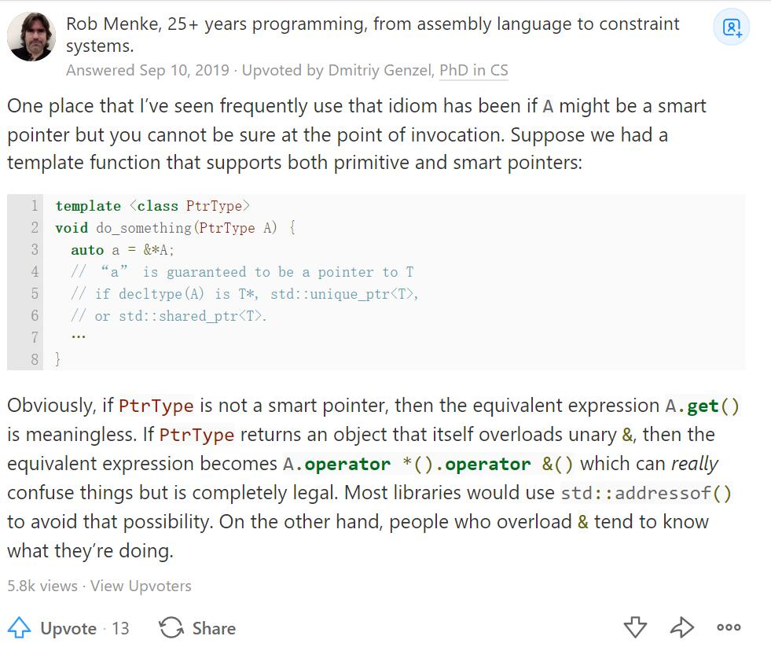

## 迭代器的分类iterator_category
5种
```cpp
struct input_iterator_tag{};
struct output_iterator_tag{};
struct forward_iterator_tag:public input_iterator_tag{};
struct bidirectional_iterator_tag:public forward_iterator_tag{};
struct random_access_iterator_tag:public bidirectional_iterator_tag{};
```

### 很多的typedef
有些时候，我们父类里面只有typedef，然后子类继承父类就等同于拥有了那些typedef...之后就没有什么了

### random_access_iterator_tag
只有连续空间才是random_access,这样才可以直接指针相减得到distance()

## iterator_category对算法的影响
distance()迭代器间距离函数,以及__advance()前进函数，都会传入分类参数，因而根据分类调用不同的函数执行

当对应的iterator_category没有写对应的函数时，没有关系，因为public继承之后有`is a`的特性，那么就会调用基类的这种函数


## 单词
trivial 不重要的
non-trivial 重要的

## &*A
A 是 pointer
见
