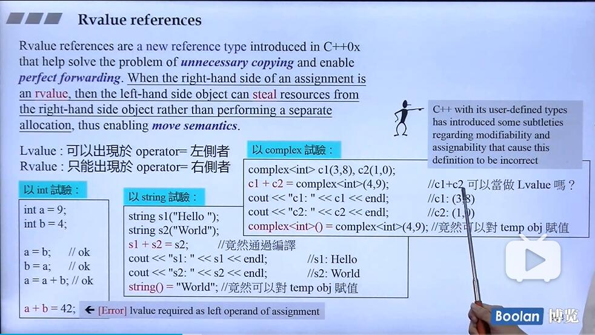

## Rvalue_references_introduction

C++ with its user-defined types has introduced some subtleties regarding modifiability and assignability that cause this definition to be incorrect

C++及其用户定义类型引入了一些有关可修改性和可分配性的细微差别，这些细微差别导致该定义不正确

右值不可以放左边，临时对象就是一种右值

但是cpp作者推翻了这个准备