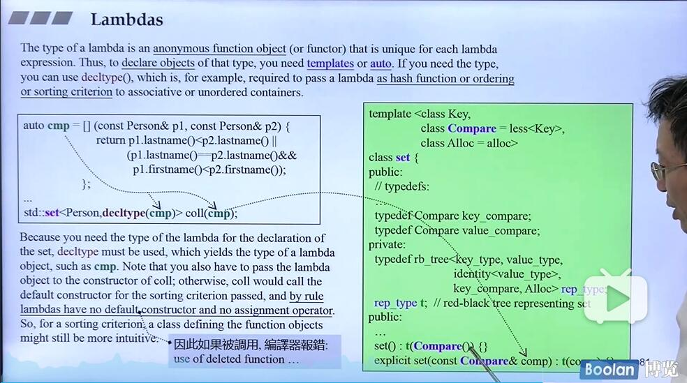

# lambda
## 简要-介绍与使用
~~使用QQ截图的文字识别去识别PPT上的文字真香~~
C++11 introduced lambdas, allowing the **definition of inline functionality**, which can **be used as a parameter or a local obiect**. **Lambdas change the way the C+ + standard library is used.**


A lambda is **a definition of functionality(机能)** that can **be defined inside statements and expressions**.
Thus, you can use a lambda as **an inline function**. The minimal lambda function has no parameters
and simply does something:

```cpp
// 这里其实可以看做一个对象或者一个类型
[]{
    std::cout<< "hello lambda" << std::endl;
}
```

You can call it directly:
```cpp
[]{
    std::cout<< "hello lambda" << std::endl;
}(); // print "hello lambda"
```
or pass it to objects to get called:
```cpp
auto l = []{
    std::cout<< "hello lambda" << std::endl;
};

// ...
// 这里可以一直拿来调用，上面却比较像一个临时对象，只能用一次
l(); // print "hello lambda"
```

## 具体形式
$[...](...)$$mutable_{opt}$ $throwSpec_{opt}$ -> $retType_{opt}${...}

### []
- `[]`里面放等号的话，表示传值,比如`[=,&y]`表示除了y传递引用之外的其他参数都使用传值___老师说他不喜欢这种方式，因为他更在意代码的可读性
- 这里面放一些参数，从外界传入，等价于类中的private数据量，当然引用传入外面的数据名的话，就有种匿名类的私有数据被随意访问改变的感觉...

### ()
表示函数的参数列表

### mutable
有这个关键字之后，那么`[]`传入的参数的值可以在这个lambda函数中改变，否则不能改变

### throwSpec
就是函数抛出异常

### retType
就是能够让lambda函数能够返回值

### lambda_decltype_note

intuitive -- 直观的，直觉的

- lambda没有默认构造函数，没有默认赋值函数...就是图片中的coll()不传入参数的话，那么你能否debug出来就是一个惊天大悬案了...你就会根本看不懂报错信息了，所以就会很迷...

2020年6月10日21:54:15 复习