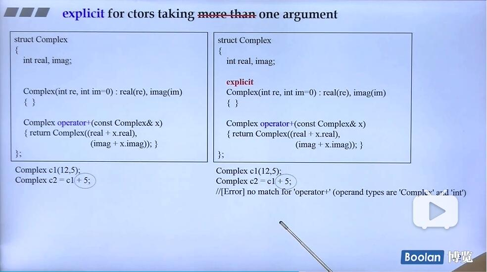

## explicit 显性的
explicit主要用在构造函数上面

禁止隐式调用，必须使用明确调用的时候才能调用

no-explicit和one-argument才能隐式转换

explicit修饰了构造函数之后只能让构造函数显性地调用

1) 指定构造函数或转换函数 (C++11 起)或推导指引 (C++17 起)为显式，即它**不能用于隐式转换和复制初始化**。

2020年6月10日21:35:52 复习