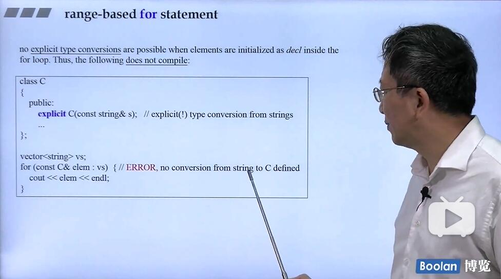

## for-range
```cpp
for ( decl : coll ) {
    statement
}
```

平时不用引用的话，是吧coll中的每一个对象一一复制给decl，如果用比较大的数据结构或者要改变对象的数值的时候，就应该使用引用，这样就可以直接只复制4个bytes的指针大小
```cpp
vector<double> vec;
// ...
for ( auto& elem : vec ) {
    elem *= 3;
}
```

### 遇到explicit的话


2020年6月10日21:39:23 复习