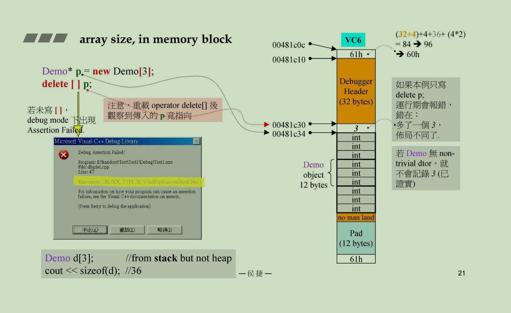

new不能重载

但是new的底层代码调用operator new是可以重载的

std::nothrow在cpp2.0直接写成noexcept

new源码中的指针会直接调用构造函数，这只能编译器做，如果要自己写，必须写成另一种版本
```cpp
// placement new ，在顶点方向创造new对象
// new(指针)函数名(函数参数)
new(p)Construct;
```

## Array new && Array delete
这里由于delete是10个int，int没有所谓的析构函数，所以调用一次和调用10次没有什么区别，当然还是养成习惯比较好，不过原理上还是要知道
```cpp
int *pi = new int[10];
delete pi;
// delete[] pi;
```

但是如果对于string类型，有指针的class，那么你每次析构都会释放一块指针指向的大块内存，如果你只delete了一次(那上面说法想到于这10个指针以及第一个指针指向的区块被释放)，那么剩下的9个指针指向的东西就没有被释放


其实上面的理解不完全正确...看了老师的下面这幅图才变得更加清晰了，就是说如果每一个数据块里面不是一个小块，而是多个块，那么内存的存放方式就会不同，上面会对出一个对象个数的count，这样就不会简单地调用之前的函数了




## 注意点
### 重载全局operator_new
这个的影响无边弗远，因为它会是全局的内存调用都这样做

### 重载class中的operator_new
要使用static，因为new过程中还没有对象，所以必须static变成类方法去调用，cpp之后因为知道这两个函数一定是static的，所以如果你没有加，它在编译的时候也会帮你默认加上

**第一个参数必须是size_t类型，而是调用时不用填入这个参数！**


### 自己申请单链表内存池
这样的好处是不用调用系统的new，因为系统每次都会给每个malloc申请的内存上下都套上4bytes的cookie，所以每个数据块都要多耗8字节

你去运行的时候，不一定你申请的内存的每一个小块的地址是连起来的，因为电脑是一个分时系统，还是多线程的，所以都不一定