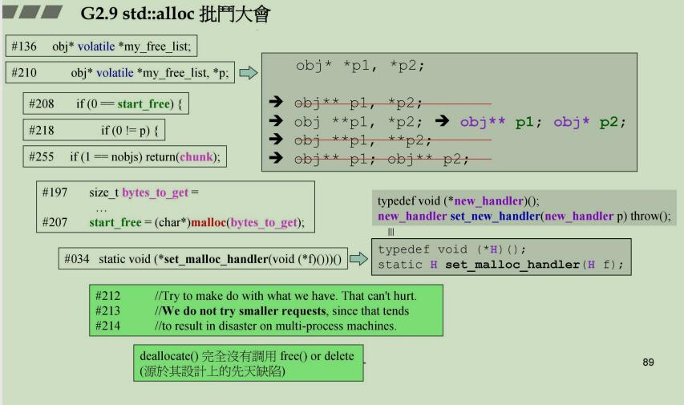

## ==判断
把常量写在左边，这样你就不会因为写成单等号而编译通过了
```cpp
// not preferct
if(start_free == 0) {}
// because you may write like follow when you are in a mess
if(start_free = 0) { }


// rigth
if(0 == start_free) { }
```


## 一些指针变量最好在用的时候再声明

## 声明变量最好声明成两行

## 使用函数指针做返回类型最好typedef先


## 考虑多线程的时候不仅要考虑自己不断获取内存，还要考虑别人(其他线程!)
换一个角度去想，人生也是这样的, 换个思路，会豁然开朗

以上见下图
