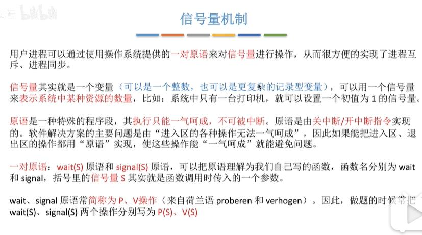

## 背景
Dijkstra(单源最短路算法的作者)在1965年提出了信号量机制

解决了软件上锁无法保证原子性，而硬件上锁又无法保证让权等待的问题

## 信号量机制

上网查了一下，原子操作是不会被多线程打断的

### 整型信号量
就是一个整数记录了资源的数量值

### 不想记笔记了...
2020年4月24日22:23:12 这两天莫名其妙地心态崩...所以面对还算比较多的学习任务量+记笔记的心理负担，导致效率急剧下降！所以尝试不记笔记，把OS学习当做电视剧来看！

快乐学习，而不要负担学习，快乐最重要