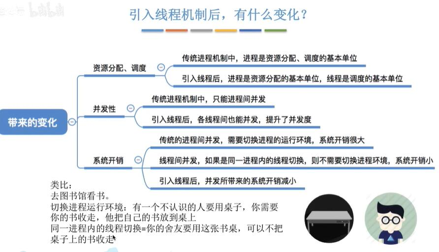
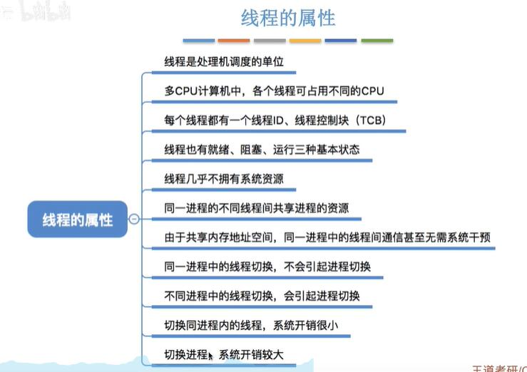
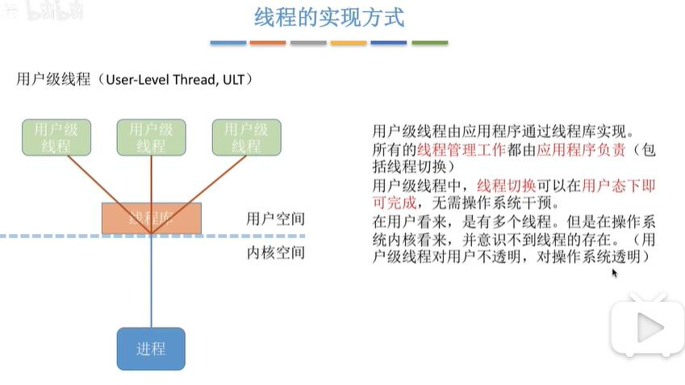
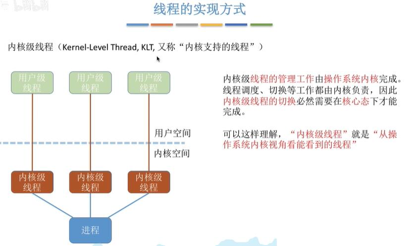
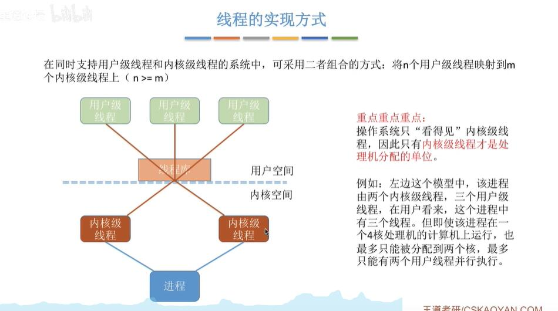
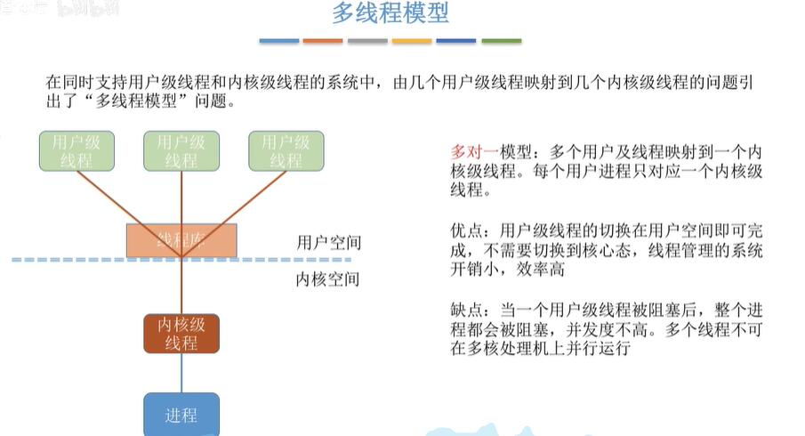
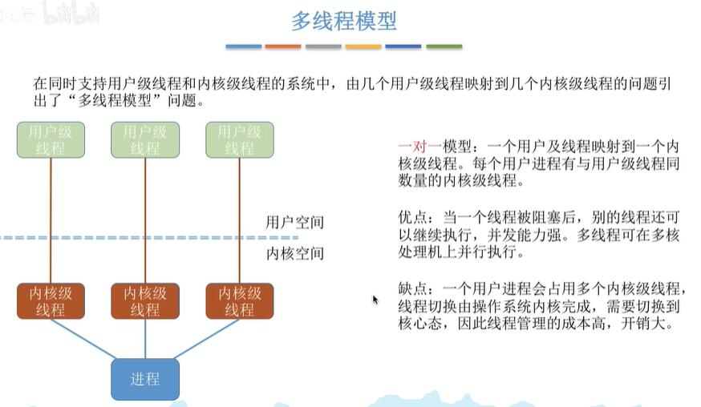
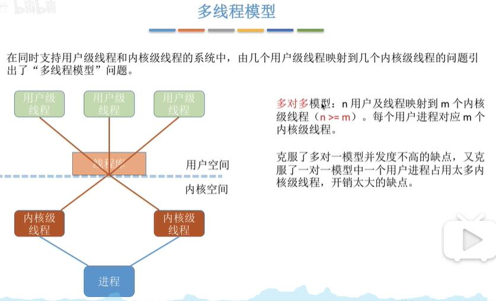

### 引入线程后

### 线程属性

### 线程实现方式
#### 用户级线程

可以这样理解，“用户级线程”就是“从用户视角看能看到的线程”

#### 内核级线程

#### 内核级线程和用户级线程映射

### 多线程模型
#### 一对多

#### 一对一

#### 多对多

### 重点回顾
- 线程是处理机调度的单位，进程是资源分配的单位
- 内核级线程才是处理机分配的单位--从而导致一对多模型中一个线程阻塞会导致整个进程都被阻塞

