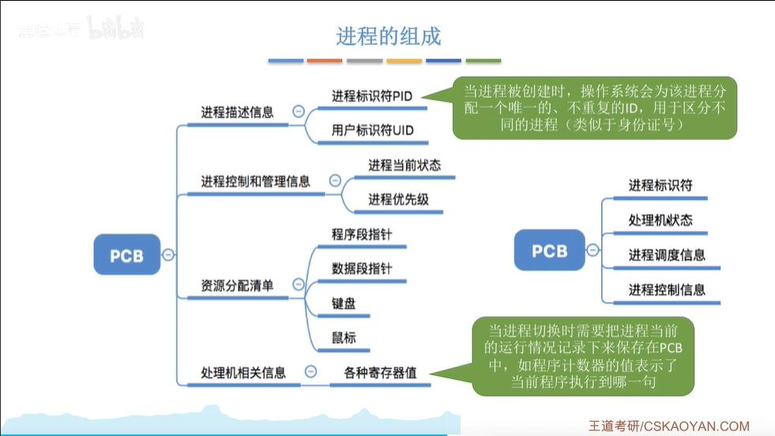
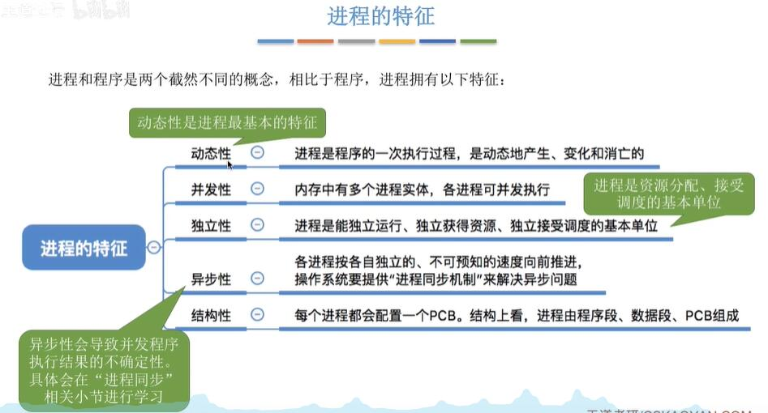

进程控制块(PCB)

PCB+程序段+数据段 == 程序实体(进程映像)

## 进程定义
程序段、数据段、PCB三部分组成了进程实体(进程映像)。 一般情况下，我们把进程实体就简称为进程，例如，所谓创建进程，实质上是创建进程实体中的PCB;而撒销进程，实质上是撒销进程实体中的PCB。
**注意: PCB是进程存在的唯-标志!**

引入进程实体的概念后，可把进程定义为:
进程是进程实体的运行过程，是系统进行资源分配和调度的一一个独立单位。
注:**严格来说，进程实体和进程并不一样，进程实体是静态的，进程则是动态的。**不过，除非题目专门
考察二者区别，否则可以认为进程实体就是进程。因此我们也可以说“进程由程序段、数据段、PCB三部
分组成

PCB组成

进程特征

