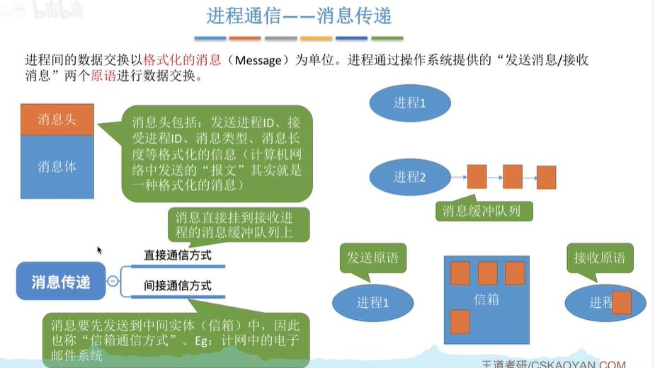

## 进程通信
### 共享存储
进程1,2访问共享空间，同步互斥

- 基于数据结构共享(限制较多)
- 基础内存空间共享(自由性大，因而功能更强)

### 管道通信
因为两个进程只能互斥访问管道
所以单管道只能半双工通信了
双管道才可以全双工通信

数据以字符流的形式写入管道，当管道写满时，写进程的write()系统调用将被阻塞，等待读进程将数据取走。当读进程将数据全部取走后，管道变空，此时读进程的read()系统调用将被阻塞。

如果没写满，就不允许读。如果没读空，就不允许写。
数据一旦被读出，就从管道中被拋弃，这就意味着读进程最多只能有一个，否则可能会有读错数据的情况。

### 消息传递
消息传递

